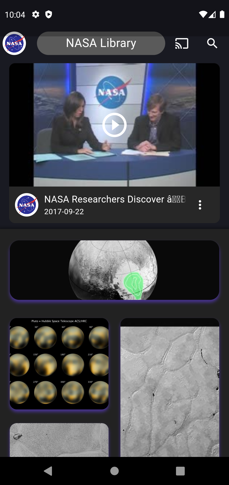
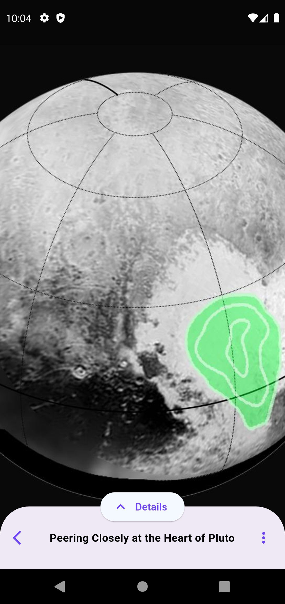

# SpaceTube - Flutter App

SpaceTube is a Flutter app that utilizes the NASA API to provide users with access to a vast library of images, videos, and podcasts related to space exploration. With SpaceTube, users can easily search for their favorite space-related content, watch videos, view images, and even listen to podcasts, all within a seamless and intuitive user interface.

## Screenshots





## Fatures

The SpaceTube app offers the following features:

* NASA API Integration: SpaceTube integrates with the NASA API to fetch and display a wide range of space-related content, including images, videos, and podcasts.
Search Functionality: Users can search for specific topics, keywords, or titles within the NASA library to find relevant content quickly.
* Image Gallery: Explore a stunning collection of space images sourced from the NASA API. Users can swipe through images, zoom in for details, and save their favorite images to their device.
* Video Player: Watch captivating space exploration videos directly within the app. The video player offers playback controls, including play, pause, seek, and full-screen mode.
* Podcast Streaming: Listen to fascinating podcasts related to space exploration, astronomy, and more. The app supports background playback, allowing users to listen to their favorite podcasts even when the app is minimized or the screen is locked.

## Installation
To install and run SpaceTube locally on your development machine, follow these steps:

1. Ensure that you have Flutter and Dart SDK installed on your machine. For installation instructions, please refer to the official Flutter website.
2. Clone the SpaceTube repository to your local machine using Git or download the source code as a ZIP file and extract it.
3. Open a terminal or command prompt and navigate to the project's root directory.
4. Run the following command to fetch and download the project dependencies:
``` flutter pub get ```
5. Connect a physical device or launch an emulator/simulator.
6. Run the following command to start the app:
``` flutter run ```
The app should now be running on your device or emulator/simulator.
## Contributing
Contributions to SpaceTube are welcome! If you'd like to contribute to the project, please follow these steps:
1.Fork the repository on GitHub.
2.Create a new branch from the main branch for your changes.
3.Make the necessary code changes, additions, or improvements.
4.Test your changes to ensure they work as expected.
5.Commit your changes and push them to your forked repository.
6.Submit a pull request, clearly describing the changes you've made and providing any additional relevant information.
